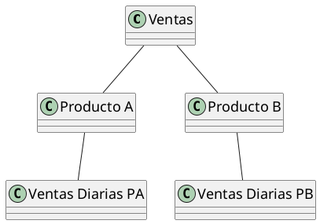
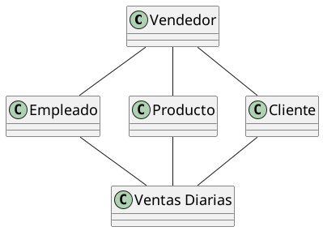
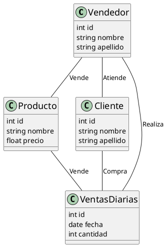

# Modelos de Bases de datos

## Introducción

Un modelo de base de datos es una representación abstracta de la estructura de una base de datos. Define la forma en que
los datos se organizan y se relacionan entre sí, así como las operaciones que se pueden realizar sobre ellos. Los
modelos de bases de datos se utilizan para describir la estructura lógica de una base de datos y proporcionar un marco
de referencia para su diseño e implementación.

## Modelos de Datos

Los modelos de datos son una parte fundamental de los sistemas de bases de datos. Proporcionan una forma de representar
la estructura de los datos y las relaciones entre ellos. Existen varios tipos de modelos de datos, cada uno con sus
propias características y ventajas. Algunos de los modelos de datos más comunes son:

### Modelo Jerárquico

El modelo jerárquico organiza los datos en una estructura de árbol, donde cada nodo representa un registro y cada
relación padre-hijo representa una relación uno a muchos. Este modelo es eficiente para representar datos con una
estructura jerárquica, pero puede resultar complejo de manejar en sistemas con relaciones complejas.



### Modelo de Red

El modelo de red es una extensión del modelo jerárquico que permite representar relaciones muchos a muchos entre los
registros. En este modelo, los registros se organizan en nodos y las relaciones se representan mediante enlaces. Aunque
es más flexible que el modelo jerárquico, puede resultar más complejo de implementar y mantener.



### Modelo Relacional

El modelo relacional organiza los datos en tablas bidimensionales, donde cada fila representa un registro y cada columna
representa un atributo. Las relaciones entre las tablas se establecen mediante claves primarias y claves foráneas. Este
modelo es el más utilizado en la actualidad debido a su simplicidad y flexibilidad.

```d2
Venta:{
    shape: sql_table
    id: int {constraint: PK}
    fecha: date
}
Producto:{
    shape: sql_table
    id: int {constraint: PK}
    nombre: string
    precio: float
}
Cliente:{
    shape: sql_table
    id: int {constraint: PK}
    nombre: string
    apellido: string
}
Vendedor:{
    shape: sql_table
    id: int {constraint: PK}
    nombre: string
    apellido: string
}
Venta <-> Producto: "Vende" {
  source-arrowhead: {
    shape: cf-one
  }
  target-arrowhead: {
    shape: cf-many
  }
}
Venta <-> Cliente: "Compra" {
  source-arrowhead: {
    shape: cf-one
  }
  target-arrowhead: {
    shape: cf-one-required
  }
}
Venta <-> Vendedor: "Realiza" {
  source-arrowhead: {
    shape: cf-many
  }
  target-arrowhead: {
    shape: cf-one-required
  }
}
```

### Modelo de Objetos

El modelo de objetos combina los conceptos de la programación orientada a objetos con las bases de datos. Permite
representar los datos como objetos con propiedades y métodos, lo que facilita la representación de estructuras de datos
complejas. Este modelo es utilizado en sistemas que requieren una representación fiel de la realidad, como sistemas de
información geográfica o sistemas de diseño asistido por computadora.



## Conclusiones

Los modelos de bases de datos son una herramienta fundamental en el diseño y la implementación de sistemas de bases de
datos. Cada modelo tiene sus propias características y ventajas, por lo que es importante elegir el modelo más adecuado
para cada aplicación. Los modelos jerárquico y de red son útiles para representar estructuras jerárquicas y relaciones
complejas, mientras que el modelo relacional es el más utilizado en la actualidad debido a su simplicidad y
flexibilidad. El modelo de objetos es ideal para representar estructuras de datos complejas y sistemas que requieren una
representación fiel de la realidad. Al comprender los diferentes modelos de bases de datos, los diseñadores y
desarrolladores pueden tomar decisiones informadas sobre la estructura y el diseño de sus bases de datos.